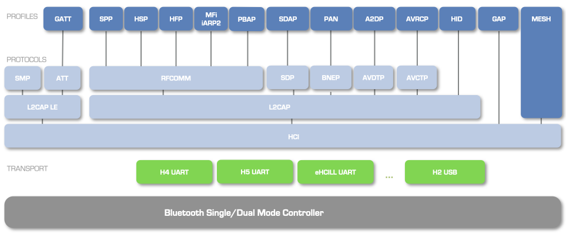

#

BTstack is a modular dual-mode Bluetooth stack, supporting both
Bluetooth Basic Rate/Enhanced Date Rate (BR/EDR) as well as Bluetooth
Low Energy (LE). The BR/EDR technology, also known as Classic Bluetooth,
provides a robust wireless connection between devices designed for high
data rates. In contrast, the LE technology has a lower throughput but
also lower energy consumption, faster connection setup, and the ability
to connect to more devices in parallel.

Whether Classic or LE, a Bluetooth device implements one or more
Bluetooth profiles. A Bluetooth profile specifies how one or more
Bluetooth protocols are used to achieve its goals. For example, every
Bluetooth device must implement the Generic Access Profile (GAP), which
defines how devices find each other and how they establish a connection.
This profile mainly make use of the Host Controller Interface (HCI)
protocol, the lowest protocol in the stack hierarchy which implements a
command interface to the Bluetooth chipset.

In addition to GAP, a popular Classic Bluetooth example would be a
peripheral devices that can be connected via the Serial Port Profile
(SPP). SPP basically specifies that a compatible device should provide a
Service Discovery Protocol (SDP) record containing an RFCOMM channel
number, which will be used for the actual communication.

Similarly, for every LE device, the Generic Attribute Profile (GATT)
profile must be implemented in addition to GAP. GATT is built on top of
the Attribute Protocol (ATT), and defines how one device can interact
with GATT Services on a remote device.

So far, the most popular use of BTstack is in peripheral devices that
can be connected via SPP (Android 2.0 or higher) and GATT (Android 4.3
or higher, and iOS 5 or higher). If higher data rates are required
between a peripheral and iOS device, the iAP1 and iAP2 protocols of the
Made for iPhone program can be used instead of GATT. Please contact us
directly for information on BTstack and MFi.

Figure {@fig:BTstackProtocolArchitecture} depicts Bluetooth protocols
and profiles that are currently implemented by BTstack.
In the following, we first explain how the various Bluetooth protocols
are used in BTstack. In the next chapter, we go over the profiles. 

 {#fig:BTstackProtocolArchitecture}

## HCI - Host Controller Interface

The HCI protocol provides a command interface to the Bluetooth chipset.
In BTstack, the HCI implementation also keeps track of all active
connections and handles the fragmentation and re-assembly of higher
layer (L2CAP) packets.

Please note, that an application rarely has to send HCI commands on its
own. Instead, BTstack provides convenience functions in GAP and higher
level protocols that use HCI automatically. E.g. to set the name, you
call *gap_set_local_name()* before powering up. The main use of HCI
commands in application is during the startup phase to configure special
features that are not available via the GAP API yet. How to send a
custom HCI command is explained in the following section.

### Defining custom HCI command templates

Each HCI command is assigned a 2-byte OpCode used to uniquely identify
different types of commands. The OpCode parameter is divided into two
fields, called the OpCode Group Field (OGF) and OpCode Command Field
(OCF), see [Bluetooth Specification](https://www.bluetooth.org/Technical/Specifications/adopted.htm) -
Core Version 4.0, Volume 2, Part E, Chapter 5.4. 

Listing [below](#lst:hciOGFs) shows the OGFs provided by BTstack in file [src/hci.h](GITHUB_URL/src/hci.h):

~~~~ {#lst:hciOGFs .c caption="{HCI OGFs provided by BTstack.}"}

    #define OGF_LINK_CONTROL  0x01
    #define OGF_LINK_POLICY  0x02
    #define OGF_CONTROLLER_BASEBAND  0x03
    #define OGF_INFORMATIONAL_PARAMETERS 0x04
    #define OGF_LE_CONTROLLER   0x08
    #define OGF_BTSTACK  0x3d
    #define OGF_VENDOR  0x3f
~~~~

For all existing Bluetooth
commands and their OCFs see [Bluetooth Specification](https://www.bluetooth.org/Technical/Specifications/adopted.htm) -
Core Version 4.0, Volume 2, Part E, Chapter 7.

In a HCI command packet, the OpCode is followed by parameter total
length, and the actual parameters. The OpCode of a command can be
calculated using the OPCODE macro. BTstack provides the *hci_cmd_t*
struct as a compact format to define HCI command packets, see 
Listing [below](#lst:HCIcmdTemplate), and [src/hci_cmd.h](GITHUB_URL/src/hci_cmd.h)
file in the source code. 

~~~~ {#lst:HCIcmdTemplate .c caption="{HCI command struct.}"}

    // Calculate combined ogf/ocf value.
    #define OPCODE(ogf, ocf) (ocf | ogf << 10)

    // Compact HCI Command packet description.
    typedef struct {
        uint16_t    opcode;
        const char *format;
    } hci_cmd_t;
~~~~ 

Listing [below](#lst:HCIcmdExample) illustrates the *hci_write_local_name* HCI
command template from library:

~~~~ {#lst:HCIcmdExample .c caption="{HCI command example.}"}

    // Sets local Bluetooth name
    const hci_cmd_t hci_write_local_name = {
        OPCODE(OGF_CONTROLLER_BASEBAND, 0x13), "N"
        // Local name (UTF-8, Null Terminated, max 248 octets)
    };
~~~~ 

It uses OGF_CONTROLLER_BASEBAND as OGF,
0x13 as OCF, and has one parameter with format “N” indicating a null
terminated UTF-8 string. Table {@tbl:hciCmdParamSpecifier} lists the format
specifiers supported by BTstack. Check for other predefined HCI commands
and info on their parameters.

  ------------------- ----------------------------------------------------
   Format Specifier   Description
        1,2,3,4       one to four byte value
           A          31 bytes advertising data
           B          Bluetooth Baseband Address
           D          8 byte data block
           E          Extended Inquiry Information 240 octets
           H          HCI connection handle
           N          Name up to 248 chars, UTF8 string, null terminated
           P          16 byte Pairing code, e.g. PIN code or link key
           S          Service Record (Data Element Sequence)  
  ------------------- ----------------------------------------------------

Table: Supported Format Specifiers of HCI Command Parameter. {#tbl:hciCmdParamSpecifier}

### Sending HCI command based on a template {#sec:sendingHCIProtocols}

You can use the *hci_send_cmd* function to send HCI command based on a
template and a list of parameters. However, it is necessary to check
that the outgoing packet buffer is empty and that the Bluetooth module
is ready to receive the next command - most modern Bluetooth modules
only allow to send a single HCI command. This can be done by calling
*hci_can_send_command_packet_now()* function, which returns true,
if it is ok to send.

Listing [below](#lst:HCIcmdExampleLocalName) illustrates how to manually set the
device name with the HCI Write Local Name command.

~~~~ {#lst:HCIcmdExampleLocalName .c caption="{Sending HCI command example.}"}

    if (hci_can_send_command_packet_now()){
        hci_send_cmd(&hci_write_local_name, "BTstack Demo");
    }  
~~~~ 

Please note, that an application rarely has to send HCI commands on its
own. Instead, BTstack provides convenience functions in GAP and higher
level protocols that use HCI automatically.

## L2CAP - Logical Link Control and Adaptation Protocol

The L2CAP protocol supports higher level protocol multiplexing and
packet fragmentation. It provides the base for the RFCOMM and BNEP
protocols. For all profiles that are officially supported by BTstack,
L2CAP does not need to be used directly. For testing or the development
of custom protocols, it’s helpful to be able to access and provide L2CAP
services however.

### Access an L2CAP service on a remote device

L2CAP is based around the concept of channels. A channel is a logical
connection on top of a baseband connection. Each channel is bound to a
single protocol in a many-to-one fashion. Multiple channels can be bound
to the same protocol, but a channel cannot be bound to multiple
protocols. Multiple channels can share the same baseband connection.

To communicate with an L2CAP service on a remote device, the application
on a local Bluetooth device initiates the L2CAP layer using the
*l2cap_init* function, and then creates an outgoing L2CAP channel to
the PSM of a remote device using the *l2cap_create_channel*
function. The *l2cap_create_channel* function will initiate
a new baseband connection if it does not already exist. The packet
handler that is given as an input parameter of the L2CAP create channel
function will be assigned to the new outgoing L2CAP channel. This
handler receives the L2CAP_EVENT_CHANNEL_OPENED and
L2CAP_EVENT_CHANNEL_CLOSED events and L2CAP data packets, as shown
in Listing [below](#lst:L2CAPremoteService).

~~~~ {#lst:L2CAPremoteService .c caption="{Accessing an L2CAP service on a remote device.}"}

    btstack_packet_handler_t l2cap_packet_handler;

    void l2cap_packet_handler(uint8_t packet_type, uint16_t channel, uint8_t *packet, uint16_t size){
        bd_addr_t event_addr;
        switch (packet_type){
            case HCI_EVENT_PACKET:
                switch (hci_event_packet_get_type(packet)){
                    case L2CAP_EVENT_CHANNEL_OPENED:
                        l2cap_event_channel_opened_get_address(packet, &event_addr);
                        psm       = l2cap_event_channel_opened_get_psm(packet); 
                        local_cid = l2cap_event_channel_opened_get_local_cid(packet); 
                        handle    = l2cap_event_channel_opened_get_handle(packet);
                        if (l2cap_event_channel_opened_get_status(packet)) {
                            printf("Connection failed\n\r");
                        } else 
                            printf("Connected\n\r");
                        }
                        break;
                    case L2CAP_EVENT_CHANNEL_CLOSED:
                        break;
                        ...
                }
            case L2CAP_DATA_PACKET:
                // handle L2CAP data packet
                break;
            ...
        }
    }

    void create_outgoing_l2cap_channel(bd_addr_t address, uint16_t psm, uint16_t mtu){
         l2cap_create_channel(NULL, l2cap_packet_handler, remote_bd_addr, psm, mtu);
    }

    void btstack_setup(){
        ...
        l2cap_init();
    }

~~~~ 

### Provide an L2CAP service

To provide an L2CAP service, the application on a local Bluetooth device
must init the L2CAP layer and register the service with
*l2cap_register_service*. From there on, it can wait for
incoming L2CAP connections. The application can accept or deny an
incoming connection by calling the *l2cap_accept_connection*
and *l2cap_deny_connection* functions respectively. 

If a connection is accepted and the incoming L2CAP channel gets successfully
opened, the L2CAP service can send and receive L2CAP data packets to the connected
device with *l2cap_send*.

Listing [below](#lst:L2CAPService)
provides L2CAP service example code.

~~~~ {#lst:L2CAPService .c caption="{Providing an L2CAP service.}"}

    void packet_handler (uint8_t packet_type, uint16_t channel, uint8_t *packet, uint16_t size){
        bd_addr_t event_addr;
        switch (packet_type){
            case HCI_EVENT_PACKET:
                switch (hci_event_packet_get_type(packet)){
                    case L2CAP_EVENT_INCOMING_CONNECTION:
                        local_cid = l2cap_event_incoming_connection_get_local_cid(packet); 
                        l2cap_accept_connection(local_cid);
                        break;
                    case L2CAP_EVENT_CHANNEL_OPENED:
                        l2cap_event_channel_opened_get_address(packet, &event_addr);
                        psm       = l2cap_event_channel_opened_get_psm(packet); 
                        local_cid = l2cap_event_channel_opened_get_local_cid(packet); 
                        handle    = l2cap_event_channel_opened_get_handle(packet);
                        if (l2cap_event_channel_opened_get_status(packet)) {
                            printf("Connection failed\n\r");
                        } else 
                            printf("Connected\n\r");
                        }
                        break;
                    case L2CAP_EVENT_CHANNEL_CLOSED:
                        break;
                        ...
                }
            case L2CAP_DATA_PACKET:
                // handle L2CAP data packet
                break;
            ...
        }
    }

    void btstack_setup(){
        ...
        l2cap_init();
        l2cap_register_service(NULL, packet_handler, 0x11,100);
    }

~~~~ 

### Sending L2CAP Data {#sec:l2capSendProtocols}

Sending of L2CAP data packets may fail due to a full internal BTstack
outgoing packet buffer, or if the ACL buffers in the Bluetooth module
become full, i.e., if the application is sending faster than the packets
can be transferred over the air.

Instead of directly calling *l2cap_send*, it is recommended to call
*l2cap_request_can_send_now_event(cahnnel_id)* which will trigger an L2CAP_EVENT_CAN_SEND_NOW
as soon as possible. It might happen that the event is received via 
packet handler before the *l2cap_request_can_send_now_event* function returns.
The L2CAP_EVENT_CAN_SEND_NOW indicates a channel ID on which sending is possible.

Please note that the guarantee that a packet can be sent is only valid when the event is received.
After returning from the packet handler, BTstack might need to send itself.

### LE Data Channels

The full title for LE Data Channels is actually LE Connection-Oriented Channels with LE Credit-Based Flow-Control Mode.
In this mode, data is sent as Service Data Units (SDUs) that can be larger than an individual HCI LE ACL packet.

LE Data Channels are similar to Classic L2CAP Channels but also provide a credit-based flow control similar to RFCOMM Channels.
Unless the LE Data Length Extension of Bluetooth Core 4.2 specification is used, the maximum packet size for LE ACL packets is 27 bytes. 
In order to send larger packets, each packet will be split into multiple ACL LE packets and recombined on the receiving side. 

In BTstack, this feature is enabled with `ENABLE_L2CAP_LE_CREDIT_BASED_FLOW_CONTROL_MODE`.

#### BTstack API

BTstack's current API for LE Credit-Based Flow-Control Mode uses the `l2cap_cbm_*` functions:

- `l2cap_cbm_register_service` / `l2cap_cbm_unregister_service`
- `l2cap_cbm_accept_connection` / `l2cap_cbm_decline_connection`
- `l2cap_cbm_create_channel`
- `l2cap_cbm_provide_credits`
- `l2cap_cbm_available_credits`

The older `l2cap_le_*` function names are still present as deprecated wrappers. New code should use the `l2cap_cbm_*` APIs.

#### Dedicated Receive Buffer Per Channel

Since multiple SDUs can be active at the same time and the individual ACL packets can be interleaved, BTstack requires a dedicated receive SDU buffer per channel.

This buffer is provided:

- by the server in `l2cap_cbm_accept_connection`
- by the client in `l2cap_cbm_create_channel`

The `mtu` parameter defines the maximal SDU size the local side is prepared to receive, and the receive buffer must match that size.

#### Sending Data

LE Credit-Based Flow-Control Mode still uses the normal `l2cap_send(...)` call to send SDUs once the channel is open.

As with other BTstack transports, applications should not send blindly. Instead, they should first request a can-send-now event:

- `l2cap_request_can_send_now_event(local_cid)`
- wait for `L2CAP_EVENT_CAN_SEND_NOW`
- send the SDU with `l2cap_send(local_cid, data, len)`

For credit-based channels, the transmitted SDU buffer must remain valid until BTstack has finished using it.
In practice, the examples only queue the next SDU after the the can-send-now event has been received.

#### Credits

When creating or accepting a channel, the `initial_credits` parameter controls how many SDU fragments the peer may 
send before it has to wait for more credits.

BTstack supports two modes:

- fixed/manual credits
- automatic credits via `L2CAP_LE_AUTOMATIC_CREDITS`

With manual credits, the application can grant additional credits later via:

    l2cap_cbm_provide_credits(local_cid, credits);

The currently available outgoing credits granted by the peer can be queried with:

    uint16_t credits = l2cap_cbm_available_credits(local_cid);

If `L2CAP_LE_AUTOMATIC_CREDITS` is used, BTstack replenishes incoming credits automatically when they fall below 
its internal watermark. This is convenient and is what the example applications use by default.

#### Security

For outgoing channels, `l2cap_cbm_create_channel(...)` includes a `security_level` parameter. 
This lets the application require a minimum LE security level before the channel is established.

For incoming channels, the security requirement is configured when registering the service:

    l2cap_cbm_register_service(packet_handler, psm, LEVEL_2);

If the current LE link security is insufficient, BTstack rejects the connection request with the corresponding L2CAP result code.

#### Events Used by BTstack Applications

The most important events for LE Credit-Based Flow-Control Mode are:

- `L2CAP_EVENT_CBM_INCOMING_CONNECTION`
- `L2CAP_EVENT_CBM_CHANNEL_OPENED`
- `L2CAP_EVENT_CHANNEL_CLOSED`
- `L2CAP_EVENT_CAN_SEND_NOW`
- `L2CAP_DATA_PACKET`

The server usually:

1. waits for `L2CAP_EVENT_CBM_INCOMING_CONNECTION`
2. calls `l2cap_cbm_accept_connection(...)`
3. processes `L2CAP_DATA_PACKET`

The client usually:

1. establishes the LE ACL connection
2. calls `l2cap_cbm_create_channel(...)`
3. waits for `L2CAP_EVENT_CBM_CHANNEL_OPENED`
4. starts sending on `L2CAP_EVENT_CAN_SEND_NOW`

#### Existing Examples

BTstack contains two examples that demonstrate the feature end-to-end:

- `example/le_credit_based_flow_control_mode_server.c`
- `example/le_credit_based_flow_control_mode_client.c`

The server example:

- registers the LE CBM service
- accepts incoming channels
- uses `L2CAP_LE_AUTOMATIC_CREDITS`
- prints throughput and received data

The client example:

- scans for `LE CBM Server`
- opens the LE CBM channel with `l2cap_cbm_create_channel(...)`
- uses `LEVEL_2` as required security level
- streams SDUs as fast as possible using `l2cap_request_can_send_now_event(...)`

#### Typical Setup Pattern

On the server side, the setup pattern is:

    static uint8_t data_channel_buffer[TEST_PACKET_SIZE];

    l2cap_init();
    l2cap_cbm_register_service(packet_handler, TSPX_le_psm, LEVEL_2);

Then, after receiving `L2CAP_EVENT_CBM_INCOMING_CONNECTION`, it accepts the connections and provides the SDU buffer:

    l2cap_cbm_accept_connection(cid, data_channel_buffer, sizeof(data_channel_buffer), L2CAP_LE_AUTOMATIC_CREDITS);

On the client side, after an LE connection is established:

    l2cap_cbm_create_channel(&packet_handler, connection_handle, TSPX_le_psm,
                             cbm_receive_buffer, sizeof(cbm_receive_buffer),
                             L2CAP_LE_AUTOMATIC_CREDITS, LEVEL_2, &local_cid);

This gives a good baseline for any application that wants reliable higher-throughput LE data transfer without building a GATT service around it.

## RFCOMM - Radio Frequency Communication Protocol

The Radio frequency communication (RFCOMM) protocol provides emulation
of serial ports over the L2CAP protocol and reassembly. It is the base
for the Serial Port Profile and other profiles used for
telecommunication like Head-Set Profile, Hands-Free Profile, Object
Exchange (OBEX) etc.

### No RFCOMM packet boundaries {#sec:noRfcommPacketBoundaries}

As RFCOMM emulates a serial port, it does not preserve packet boundaries. 

On most operating systems, RFCOMM/SPP will be modeled as a pipe that allows
to write a block of bytes. The OS and the Bluetooth Stack are free to buffer
and chunk this data in any way it seems fit. In your BTstack application, you will
therefore receive this data in the same order, but there are no guarantees as
how it might be fragmented into multiple chunks.

If you need to preserve the concept of sending a packet with a specific size
over RFCOMM, the simplest way is to prefix the data with a 2 or 4 byte length field
and then reconstruct the packet on the receiving side.

Please note, that due to BTstack's 'no buffers' policy, BTstack will send outgoing RFCOMM data immediately 
and implicitly preserve the packet boundaries, i.e., it will send the data as a single
RFCOMM packet in a single L2CAP packet, which will arrive in one piece. 
While this will hold between two BTstack instances, it's not a good idea to rely on implementation details
and rather prefix the data as described.

### RFCOMM flow control {#sec:flowControlProtocols}

RFCOMM has a mandatory credit-based flow-control. This means that two
devices that established RFCOMM connection, use credits to keep track of
how many more RFCOMM data packets can be sent to each. If a device has
no (outgoing) credits left, it cannot send another RFCOMM packet, the
transmission must be paused. During the connection establishment,
initial credits are provided. BTstack tracks the number of credits in
both directions. If no outgoing credits are available, the RFCOMM send
function will return an error, and you can try later. For incoming data,
BTstack provides channels and services with and without automatic credit
management via different functions to create/register them respectively.
If the management of credits is automatic, the new credits are provided
when needed relying on ACL flow control - this is only useful if there
is not much data transmitted and/or only one physical connection is
used. If the management of credits is manual, credits are provided by
the application such that it can manage its receive buffers explicitly.

### Access an RFCOMM service on a remote device {#sec:rfcommClientProtocols}

To communicate with an RFCOMM service on a remote device, the
application on a local Bluetooth device initiates the RFCOMM layer using
the *rfcomm_init* function, and then creates an outgoing RFCOMM channel
to a given server channel on a remote device using the
*rfcomm_create_channel* function. The
*rfcomm_create_channel* function will initiate a new L2CAP
connection for the RFCOMM multiplexer, if it does not already exist. The
channel will automatically provide enough credits to the remote side. To
provide credits manually, you have to create the RFCOMM connection by
calling *rfcomm_create_channel_with_initial_credits* -
see Section [on manual credit assignement](#sec:manualCreditsProtocols).

The packet handler that is given as an input parameter of the RFCOMM
create channel function will be assigned to the new outgoing channel.
This handler receives the RFCOMM_EVENT_CHANNEL_OPENED and
RFCOMM_EVENT_CHANNEL_CLOSED events, and RFCOMM data packets, as shown in
Listing [below](#lst:RFCOMMremoteService).

~~~~ {#lst:RFCOMMremoteService .c caption="{RFCOMM handler for outgoing RFCOMM channel.}"}

    void rfcomm_packet_handler(uint8_t packet_type, uint16_t channel, uint8_t *packet, uint16_t size){
        switch (packet_type){
            case HCI_EVENT_PACKET:
                switch (hci_event_packet_get_type(packet)){
                    case RFCOMM_EVENT_CHANNEL_OPENED:
                        if (rfcomm_event_open_channel_complete_get_status(packet)) {
                            printf("Connection failed\n\r");
                        } else {
                            printf("Connected\n\r");
                        }
                        break;
                    case RFCOMM_EVENT_CHANNEL_CLOSED:
                        break;
                    ...
                }
                break;
            case RFCOMM_DATA_PACKET:
                // handle RFCOMM data packets
                return;
        }
    }

    void create_rfcomm_channel(uint8_t packet_type, uint8_t *packet, uint16_t size){
        rfcomm_create_channel(rfcomm_packet_handler, addr, rfcomm_channel);
    }

    void btstack_setup(){
        ...
        l2cap_init();
        rfcomm_init();
    }

~~~~ 

The RFCOMM channel will stay open until either side closes it with rfcomm_disconnect.
The RFCOMM multiplexer will be closed by the peer that closes the last RFCOMM channel.

### Provide an RFCOMM service {#sec:rfcommServiceProtocols}

To provide an RFCOMM service, the application on a local Bluetooth
device must first init the L2CAP and RFCOMM layers and then register the
service with *rfcomm_register_service*. From there on, it
can wait for incoming RFCOMM connections. The application can accept or
deny an incoming connection by calling the
*rfcomm_accept_connection* and *rfcomm_deny_connection* functions respectively.
If a connection is accepted and the incoming RFCOMM channel gets successfully
opened, the RFCOMM service can send RFCOMM data packets to the connected
device with *rfcomm_send* and receive data packets by the
packet handler provided by the *rfcomm_register_service*
call.

Listing [below](#lst:RFCOMMService) provides the RFCOMM service example code.

~~~~ {#lst:RFCOMMService .c caption="{Providing an RFCOMM service.}"}
    
    void packet_handler(uint8_t packet_type, uint16_t channel, uint8_t *packet, uint16_t size){
        switch (packet_type){
            case HCI_EVENT_PACKET:
                switch (hci_event_packet_get_type(packet)){
                    case RFCOMM_EVENT_INCOMING_CONNECTION:
                        rfcomm_channel_id = rfcomm_event_incoming_connection_get_rfcomm_cid(packet);
                        rfcomm_accept_connection(rfcomm_channel_id);
                        break;
                    case RFCOMM_EVENT_CHANNEL_OPENED:
                        if (rfcomm_event_open_channel_complete_get_status(packet)){
                            printf("RFCOMM channel open failed.");
                            break;
                        } 
                        rfcomm_channel_id = rfcomm_event_open_channel_complete_get_rfcomm_cid(packet);
                        mtu = rfcomm_event_open_channel_complete_get_max_frame_size(packet);
                        printf("RFCOMM channel open succeeded, max frame size %u.", mtu);
                        break;
                    case RFCOMM_EVENT_CHANNEL_CLOSED:
                        printf("Channel closed.");
                        break;
                    ...
                }
                break;
            case RFCOMM_DATA_PACKET:
                // handle RFCOMM data packets
                return;
            ...
        }
        ...
    }
    
    void btstack_setup(){
        ...
        l2cap_init();
        rfcomm_init();
        rfcomm_register_service(packet_handler, rfcomm_channel_nr, mtu); 
    }

~~~~ 

### Slowing down RFCOMM data reception {#sec:manualCreditsProtocols}

RFCOMM’s credit-based flow-control can be used to adapt, i.e., slow down
the RFCOMM data to your processing speed. For incoming data, BTstack
provides channels and services with and without automatic credit
management. If the management of credits is automatic, new credits 
are provided when needed relying on ACL flow control. This is only 
useful if there is not much data transmitted and/or only one physical 
connection is used. See Listing [below](#lst:automaticFlowControl).
 
~~~~ {#lst:automaticFlowControl .c caption="{RFCOMM service with automatic credit management.}"}   
    void btstack_setup(void){
        ...
        // init RFCOMM
        rfcomm_init();
        rfcomm_register_service(packet_handler, rfcomm_channel_nr, 100); 
    }
~~~~ 

If the management of credits is manual, credits are provided by the
application such that it can manage its receive buffers explicitly, see
Listing [below](#lst:explicitFlowControl).

Manual credit management is recommended when received RFCOMM data cannot
be processed immediately. In the [SPP flow control example](../examples/examples/#sec:sppflowcontrolExample), 
delayed processing of received data is
simulated with the help of a periodic timer. To provide new credits, you
call the *rfcomm_grant_credits* function with the RFCOMM channel ID
and the number of credits as shown in Listing [below](#lst:NewCredits). 

~~~~ {#lst:explicitFlowControl .c caption="{RFCOMM service with manual credit management.}"}   
    void btstack_setup(void){
        ...
        // init RFCOMM
        rfcomm_init();
        // reserved channel, mtu=100, 1 credit
        rfcomm_register_service_with_initial_credits(packet_handler, rfcomm_channel_nr, 100, 1);  
    }
~~~~ 

~~~~ {#lst:NewCredits .c caption="{Granting RFCOMM credits.}"} 
    void processing(){
        // process incoming data packet
        ... 
        // provide new credit
        rfcomm_grant_credits(rfcomm_channel_id, 1);
    }
~~~~ 

Please note that providing single credits effectively reduces the credit-based
(sliding window) flow control to a stop-and-wait flow-control that
limits the data throughput substantially. On the plus side, it allows
for a minimal memory footprint. If possible, multiple RFCOMM buffers
should be used to avoid pauses while the sender has to wait for a new
credit.

### Sending RFCOMM data {#sec:rfcommSendProtocols}

Outgoing packets, both commands and data, are not queued in BTstack.
This section explains the consequences of this design decision for
sending data and why it is not as bad as it sounds.

Independent from the number of output buffers, packet generation has to
be adapted to the remote receiver and/or maximal link speed. Therefore,
a packet can only be generated when it can get sent. With this
assumption, the single output buffer design does not impose additional
restrictions. In the following, we show how this is used for adapting
the RFCOMM send rate.

When there is a need to send a packet, call *rcomm_request_can_send_now* 
and wait for the reception of the RFCOMM_EVENT_CAN_SEND_NOW event 
to send the packet, as shown in Listing [below](#lst:rfcommRequestCanSendNow).

Please note that the guarantee that a packet can be sent is only valid when the event is received.
After returning from the packet handler, BTstack might need to send itself.

~~~~ {#lst:rfcommRequestCanSendNow .c caption="{Preparing and sending data.}"}    
    void prepare_data(uint16_t rfcomm_channel_id){
        ...
        // prepare data in data_buffer
        rfcomm_request_can_send_now_event(rfcomm_channel_id);
    }

    void send_data(uint16_t rfcomm_channel_id){
        rfcomm_send(rfcomm_channel_id,  data_buffer, data_len);
        // packet is handed over to BTstack, we can prepare the next one
        prepare_data(rfcomm_channel_id);
    }

    void packet_handler(uint8_t packet_type, uint16_t channel, uint8_t *packet, uint16_t size){
        switch (packet_type){
            case HCI_EVENT_PACKET:
                switch (hci_event_packet_get_type(packet)){
                    ...
                    case RFCOMM_EVENT_CAN_SEND_NOW:
                        rfcomm_channel_id = rfcomm_event_can_send_now_get_rfcomm_cid(packet);
                        send_data(rfcomm_channel_id);
                        break;
                    ...
                }
                ...
            }
        }
    }

~~~~ 

### Optimized sending of RFCOMM data

When sending RFCOMM data via *rfcomm_send*, BTstack needs to copy the data
from the user provided buffer into the outgoing buffer. This requires both
an additional buffer for the user data as well requires a copy operation.

To avoid this, it is possible to directly write the user data into the outgoing buffer.

When get the RFCOMM_CAN_SEND_NOW event, you call *rfcomm_reserve_packet_buffer* to
lock the buffer for your send operation. Then, you can ask how many bytes you can send 
with *rfcomm_get_max_frame_size* and get a pointer to BTstack's buffer with
*rfcomm_get_outgoing_buffer*. Now, you can fill that buffer and finally send the
data with *rfcomm_send_prepared*.

## SDP - Service Discovery Protocol

The SDP protocol allows to announce services and discover services
provided by a remote Bluetooth device.

### Create and announce SDP records

BTstack contains a complete SDP server and allows to register SDP
records. An SDP record is a list of SDP Attribute *{ID, Value}* pairs
that are stored in a Data Element Sequence (DES). The Attribute ID is a
16-bit number, the value can be of other simple types like integers or
strings or can itself contain other DES.

To create an SDP record for an SPP service, you can call
*spp_create_sdp_record* from with a pointer to a buffer to store the
record, the server channel number, and a record name.

For other types of records, you can use the other functions in, using
the data element *de_* functions. Listing [sdpCreate] shows how an SDP
record containing two SDP attributes can be created. First, a DES is
created and then the Service Record Handle and Service Class ID List
attributes are added to it. The Service Record Handle attribute is added
by calling the *de_add_number* function twice: the first time to add
0x0000 as attribute ID, and the second time to add the actual record
handle (here 0x1000) as attribute value. The Service Class ID List
attribute has ID 0x0001, and it requires a list of UUIDs as attribute
value. To create the list, *de_push_sequence* is called, which “opens”
a sub-DES. The returned pointer is used to add elements to this sub-DES.
After adding all UUIDs, the sub-DES is “closed” with
*de_pop_sequence*.

To register an SDP record, you call *sdp_register_service* with a pointer to it.
The SDP record can be stored in FLASH since BTstack only stores the pointer.
Please note that the buffer needs to persist (e.g. global storage, dynamically
allocated from the heap or in FLASH) and cannot be used to create another SDP
record.

### Query remote SDP service {#sec:querySDPProtocols}

BTstack provides an SDP client to query SDP services of a remote device.
The SDP Client API is shown in [here](../appendix/apis/#sec:sdpAPIAppendix). The
*sdp_client_query* function initiates an L2CAP connection to the
remote SDP server. Upon connect, a *Service Search Attribute* request
with a *Service Search Pattern* and a *Attribute ID List* is sent. The
result of the *Service Search Attribute* query contains a list of
*Service Records*, and each of them contains the requested attributes.
These records are handled by the SDP parser. The parser delivers
SDP_PARSER_ATTRIBUTE_VALUE and SDP_PARSER_COMPLETE events via a
registered callback. The SDP_PARSER_ATTRIBUTE_VALUE event delivers
the attribute value byte by byte.

On top of this, you can implement specific SDP queries. For example,
BTstack provides a query for RFCOMM service name and channel number.
This information is needed, e.g., if you want to connect to a remote SPP
service. The query delivers all matching RFCOMM services, including its
name and the channel number, as well as a query complete event via a
registered callback, as shown in Listing [below](#lst:SDPClientRFCOMM).

~~~~ {#lst:SDPClientRFCOMM .c caption="{Searching RFCOMM services on a remote device.}"}

    bd_addr_t remote = {0x04,0x0C,0xCE,0xE4,0x85,0xD3};

    void packet_handler (void * connection, uint8_t packet_type, uint16_t channel, uint8_t *packet, uint16_t size){
        if (packet_type != HCI_EVENT_PACKET) return;

        uint8_t event = packet[0];
        switch (event) {
            case BTSTACK_EVENT_STATE:
                // bt stack activated, get started 
                if (btstack_event_state_get_state(packet) == HCI_STATE_WORKING){
                      sdp_client_query_rfcomm_channel_and_name_for_uuid(remote, 0x0003);
                }
                break;
            default:
                break;
        }
    }

    static void btstack_setup(){
       ...
        // init L2CAP
        l2cap_init();
        l2cap_register_packet_handler(packet_handler);
    }

    void handle_query_rfcomm_event(sdp_query_event_t * event, void * context){
        sdp_client_query_rfcomm_service_event_t * ve;
                
        switch (event->type){
            case SDP_EVENT_QUERY_RFCOMM_SERVICE:
                ve = (sdp_client_query_rfcomm_service_event_t*) event;
                printf("Service name: '%s', RFCOMM port %u\n", ve->service_name, ve->channel_nr);
                break;
            case SDP_EVENT_QUERY_COMPLETE:
                report_found_services();
                printf("Client query response done with status %d. \n", ce->status);
                break;
        }
    }

    int main(void){
        hw_setup();
        btstack_setup();
        
        // register callback to receive matching RFCOMM Services and 
        // query complete event 
        sdp_client_query_rfcomm_register_callback(handle_query_rfcomm_event, NULL);

        // turn on!
        hci_power_control(HCI_POWER_ON);
        // go!
        btstack_run_loop_execute(); 
        return 0;
    }
~~~~ 

## BNEP - Bluetooth Network Encapsulation Protocol

The BNEP protocol is used to transport control and data packets over
standard network protocols such as TCP, IPv4 or IPv6. It is built on top
of L2CAP, and it specifies a minimum L2CAP MTU of 1691 bytes.

### Receive BNEP events

To receive BNEP events, please register a packet handler with
*bnep_register_packet_handler*.

### Access a BNEP service on a remote device {#sec:bnepClientProtocols}

To connect to a remote BNEP service, you need to know its UUID. The set
of available UUIDs can be queried by a SDP query for the PAN profile.
Please see section on [PAN profile](../profiles/#sec:panProfiles) for details. 
With the remote UUID, you can create a connection using the *bnep_connect* 
function. You’ll receive a *BNEP_EVENT_CHANNEL_OPENED* on success or
failure.

After the connection was opened successfully, you can send and receive
Ethernet packets. Before sending an Ethernet frame with *bnep_send*,
*bnep_can_send_packet_now* needs to return true. Ethernet frames
are received via the registered packet handler with packet type
*BNEP_DATA_PACKET*.

BTstack BNEP implementation supports both network protocol filter and
multicast filters with *bnep_set_net_type_filter* and
*bnep_set_multicast_filter* respectively.

Finally, to close a BNEP connection, you can call *bnep_disconnect*.

### Provide BNEP service {#sec:bnepServiceProtocols}

To provide a BNEP service, call *bnep_register_service* with the
provided service UUID and a max frame size.

A *BNEP_EVENT_INCOMING_CONNECTION* event will mark that an incoming
connection is established. At this point you can start sending and
receiving Ethernet packets as described in the previous section.

### Sending Ethernet packets

Similar to L2CAP and RFOMM, directly sending an Ethernet packet via BNEP might fail,
if the outgoing packet buffer or the ACL buffers in the Bluetooth module are full.

When there's a need to send an Ethernet packet, call *bnep_request_can_send_now* 
and send the packet when the BNEP_EVENT_CAN_SEND_NOW event
gets received.

## ATT - Attribute Protocol

The ATT protocol is used by an ATT client to read and write attribute
values stored on an ATT server. In addition, the ATT server can notify
the client about attribute value changes. An attribute has a handle, a
type, and a set of properties.

The Generic Attribute (GATT) profile is built upon ATT and provides
higher level organization of the ATT attributes into GATT Services and
GATT Characteristics. In BTstack, the complete ATT client functionality
is included within the GATT Client. See [GATT client](../profiles/#sec:GATTClientProfiles) for more.

On the server side, one ore more GATT profiles are converted ahead of time 
into the corresponding ATT attribute database and provided by the *att_server*
implementation. The constant data are automatically served by the ATT server upon client
request. To receive the dynamic data, such is characteristic value, the
application needs to register read and/or write callback. In addition,
notifications and indications can be sent. Please see Section on 
[GATT server](../profiles/#sec:GATTServerProfile) for more.

## SMP - Security Manager Protocol {#sec:smpProtocols}

The SMP protocol allows to setup authenticated and encrypted LE
connection. After initialization and configuration, SMP handles security
related functions on its own but emits events when feedback from the
main app or the user is required. The two main tasks of the SMP protocol
are: bonding and identity resolving.

### LE Legacy Pairing and LE Secure Connections

The original pairing algorithm introduced in Bluetooth Core V4.0 does not
provide security in case of an attacker present during the initial pairing.
To fix this, the Bluetooth Core V4.2 specification introduced the new
*LE Secure Connections* method, while referring to the original method as *LE Legacy Pairing*.

BTstack supports both pairing methods. To enable the more secure LE Secure Connections method,
*ENABLE_LE_SECURE_CONNECTIONS* needs to be defined in *btstack_config.h*.

LE Secure Connections are based on Elliptic Curve Diffie-Hellman (ECDH) algorithm for the key exchange.
On start, a new public/private key pair is generated. During pairing, the
Long Term Key (LTK) is generated based on the local keypair and the remote public key.
To facilitate the creation of such a keypairs and the calculation of the LTK,
the Bluetooth Core V4.2 specification introduced appropriate commands for the Bluetooth controller.

As an alternative for controllers that don't provide these primitives, BTstack provides the relevant cryptographic functions in software via the BSD-2-Clause licensed [micro-ecc library](https://github.com/kmackay/micro-ecc/tree/static).
When using using LE Secure Connections, the Peripheral must store LTK in non-volatile memory.

To only allow LE Secure Connections, you can call *sm_set_secure_connections_only_mode(true)*.

### Initialization

To activate the security manager, call *sm_init()*.

If you’re creating a product, you should also call *sm_set_ir()* and
*sm_set_er()* with a fixed random 16 byte number to create the IR and
ER key seeds. If possible use a unique random number per device instead
of deriving it from the product serial number or something similar. The
encryption key generated by the BLE peripheral will be ultimately
derived from the ER key seed. See 
[Bluetooth Specification](https://www.bluetooth.org/Technical/Specifications/adopted.htm) -
Bluetooth Core V4.0, Vol 3, Part G, 5.2.2 for more details on deriving
the different keys. The IR key is used to identify a device if private,
resolvable Bluetooth addresses are used.

### Configuration

To receive events from the Security Manager, a callback is necessary.
How to register this packet handler depends on your application
configuration.

When *att_server* is used to provide a GATT/ATT service, *att_server*
registers itself as the Security Manager packet handler. Security
Manager events are then received by the application via the
*att_server* packet handler.

If *att_server* is not used, you can directly register your packet
handler with the security manager by calling
*sm_register_packet_handler*.

The default SMP configuration in BTstack is to be as open as possible:

-   accept all Short Term Key (STK) Generation methods,

-   accept encryption key size from 7..16 bytes,

-   expect no authentication requirements,

-   don't require LE Secure Connections, and

-   IO Capabilities set to *IO_CAPABILITY_NO_INPUT_NO_OUTPUT*.

You can configure these items by calling following functions
respectively:

-   *sm_set_accepted_stk_generation_methods*

-   *sm_set_encryption_key_size_range*

-   *sm_set_authentication_requirements* : add SM_AUTHREQ_SECURE_CONNECTION flag to enable LE Secure Connections

-   *sm_set_io_capabilities*

### Identity Resolving

Identity resolving is the process of matching a private, resolvable
Bluetooth address to a previously paired device using its Identity
Resolving (IR) key. After an LE connection gets established, BTstack
automatically tries to resolve the address of this device. During this
lookup, BTstack will emit the following events:

-   *SM_EVENT_IDENTITY_RESOLVING_STARTED* to mark the start of a lookup,

and later:

-   *SM_EVENT_IDENTITY_RESOLVING_SUCCEEDED* on lookup success, or

-   *SM_EVENT_IDENTITY_RESOLVING_FAILED* on lookup failure.

### User interaction during Pairing

BTstack will inform the app about pairing via theses events: 

  - *SM_EVENT_PAIRING_STARTED*: inform user that pairing has started
  - *SM_EVENT_PAIRING_COMPLETE*: inform user that pairing is complete, see status

Depending on the authentication requirements, IO capabilities, 
available OOB data, and the enabled STK generation methods,
BTstack will request feedback from
the app in the form of an event:

  - *SM_EVENT_JUST_WORKS_REQUEST*: request a user to accept a Just Works pairing
  - *SM_EVENT_PASSKEY_INPUT_NUMBER*: request user to input a passkey
  - *SM_EVENT_PASSKEY_DISPLAY_NUMBER*: show a passkey to the user
  - *SM_EVENT_PASSKEY_DISPLAY_CANCEL*: cancel show passkey to user
  - *SM_EVENT_NUMERIC_COMPARISON_REQUEST*: show a passkey to the user and request confirmation

To accept Just Works/Numeric Comparison, or provide a Passkey, *sm_just_works_confirm* or *sm_passkey_input* can be called respectively.
Othwerise, *sm_bonding_decline* aborts the pairing.

After the bonding process, *SM_EVENT_PAIRING_COMPLETE*, is emitted. Any active dialog can be closed on this.

### Connection with Bonded Devices

During pairing, two devices exchange bonding information, notably a Long-Term Key (LTK) and their respective Identity Resolving Key (IRK).
On a subsequent connection, the Securit Manager will use this information to establish an encrypted connection.

To inform about this, the following events are emitted:

  - *SM_EVENT_REENCRYPTION_STARTED*: we have stored bonding information and either trigger encryption (as Central), or, sent a security request (as Peripheral).
  - *SM_EVENT_REENCRYPTION_COMPLETE*: re-encryption is complete. If the remote device does not have a stored LTK, the status code will be *ERROR_CODE_PIN_OR_KEY_MISSING*.

The *SM_EVENT_REENCRYPTION_COMPLETE* with  *ERROR_CODE_PIN_OR_KEY_MISSING* can be caused:

  - if the remote device was reset or the bonding was removed, or,
  - we're connected to an attacker that uses the Bluetooth address of a bonded device.
    
In Peripheral role, pairing will start even in case of an re-encryption error. It might be helpful to inform the user about the lost bonding or reject it right away due to security considerations.

### Keypress Notifications

As part of Bluetooth Core V4.2 specification, a device with a keyboard but no display can send keypress notifications to provide better user feedback. In BTstack, the *sm_keypress_notification()* function is used for sending notifications. Notifications are received by BTstack via the *SM_EVENT_KEYPRESS_NOTIFICATION* event.

### Cross-transport Key Derivation (CTKD) for LE Secure Connections

Cross-transport Key Derivation (CTKD) allows a dual-mode device to derive bonding material for one Bluetooth transport from bonding material established on the other transport.

In BTstack, CTKD is enabled at compile time by defining `ENABLE_CROSS_TRANSPORT_KEY_DERIVATION`.

#### Prerequisites

BTstack currently requires:

- `ENABLE_CLASSIC`
- `ENABLE_BLE`
- `ENABLE_LE_SECURE_CONNECTIONS`
- `ENABLE_CROSS_TRANSPORT_KEY_DERIVATION`

The implementation enforces the essential requirement that CTKD is only used together with LE Secure Connections and BR/EDR support.

#### What BTstack Derives

BTstack supports both directions defined for dual-mode Secure Connections:

- derive a BR/EDR Link Key from an LE LTK after LE Secure Connections bonding
- derive an LE LTK from a BR/EDR Link Key after BR/EDR Secure Connections bonding

For the derivation, BTstack uses the Bluetooth-specified conversion functions `h6` or `h7` depending on the negotiated authentication flags.

#### Main Use Case

The main practical use case is pairing over LE first and then reusing that trust relationship for BR/EDR.

This is particularly useful with smartphones. For example, iOS exposes APIs for LE discovery and pairing, but not for establishing arbitrary Classic pairings from an app. With CTKD, an application can pair over LE and later open a BR/EDR connection without sending the user through the system Bluetooth settings again.

#### Storage in BTstack

When CTKD derives a Classic Link Key from LE bonding material, BTstack stores it in the Classic Link Key database via the normal link key storage path.

When CTKD derives an LE LTK from BR/EDR Secure Connections bonding, BTstack stores it in the LE device database via the normal LE bonding storage path.

In other words, CTKD does not introduce a separate persistence mechanism. It feeds the derived keys into BTstack's existing:

- Classic link key database
- LE device database

If either side is not persisted, that derived trust relationship will also be lost after reset.

#### Setup from the Application Perspective

From an application point of view, CTKD setup is simple:

1. Enable the compile-time option `ENABLE_CROSS_TRANSPORT_KEY_DERIVATION`.
2. Initialize the LE Security Manager by calling `sm_init()`.
3. Make sure persistent storage for both LE bonding data and Classic link keys is configured if the relationship should survive reboot.

This is why a number of Classic examples call `sm_init()` when BLE is enabled and explicitly note that it is needed for cross-transport key derivation, for example:

- `example/spp_counter.c`
- `example/gap_dedicated_bonding.c`
- `example/hid_keyboard_demo.c`

Even if the primary profile in such an example is Classic-only, CTKD support still depends on the LE Security Manager being initialized.

#### How to Tell if CTKD Was Used

BTstack reports whether CTKD participated in the finished pairing via `SM_EVENT_PAIRING_COMPLETE`.

The event contains the `ctkd_active` field, which can be queried with:

    sm_event_pairing_complete_get_ctkd_active(packet)

The pairing examples already print this field:

- `example/sm_pairing_central.c`
- `example/sm_pairing_peripheral.c`

A value of `1` indicates that CTKD was active for the completed pairing.

#### Security Restrictions and Rejection Cases

BTstack does not blindly overwrite stronger existing bonding material.

In particular, the implementation checks whether the derived key would lower the authentication level of an already stored key and avoids doing so. This is intended to reduce downgrade risk and reflects the stricter security guidance introduced after the BLURtooth discussion.

BTstack also rejects CTKD in situations where it is not allowed, for example if BR/EDR Secure Connections requirements are not met. In this case, pairing can fail with:

    SM_REASON_CROSS_TRANSPORT_KEY_DERIVATION_NOT_ALLOWED

The implementation also rejects CTKD when the BR/EDR side falls back to P-192 based encryption instead of Secure Connections grade protection.

#### Practical Notes

- CTKD is about deriving transport keys, not merging transports. LE and BR/EDR still run their own connection and security procedures.
- Attribute-level GATT permissions and Classic profile security still apply normally after derivation.
- CTKD is most useful on dual-mode products that expose different features over LE and BR/EDR but want one pairing step to unlock both.

### Out-of-Band Data with LE Legacy Pairing

LE Legacy Pairing can be made secure by providing a way for both devices
to acquire a pre-shared secret 16 byte key by some fancy method.
In most cases, this is not an option, especially since popular OS like iOS
don’t provide a way to specify it. In some applications, where both
sides of a Bluetooth link are developed together, this could provide a
viable option.

To provide OOB data, you can register an OOB data callback with
*sm_register_oob_data_callback*.
