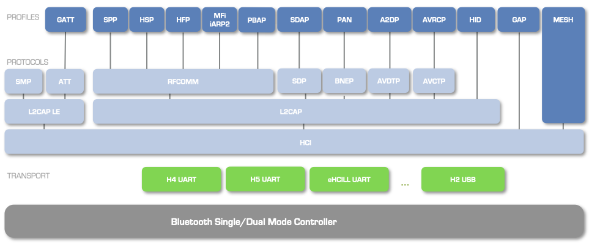

BTstack is a modular dual-mode Bluetooth stack, supporting both
Bluetooth Basic Rate/Enhanced Date Rate (BR/EDR) as well as Bluetooth
Low Energy (LE). The BR/EDR technology, also known as Classic Bluetooth,
provides a robust wireless connection between devices designed for high
data rates. In contrast, the LE technology has a lower throughput but
also lower energy consumption, faster connection setup, and the ability
to connect to more devices in parallel.

Whether Classic or LE, a Bluetooth device implements one or more
Bluetooth profiles. A Bluetooth profile specifies how one or more
Bluetooth protocols are used to achieve its goals. For example, every
Bluetooth device must implement the Generic Access Profile (GAP), which
defines how devices find each other and how they establish a connection.
This profile mainly make use of the Host Controller Interface (HCI)
protocol, the lowest protocol in the stack hierarchy which implements a
command interface to the Bluetooth chipset.

In addition to GAP, a popular Classic Bluetooth example would be a
peripheral devices that can be connected via the Serial Port Profile
(SPP). SPP basically specifies that a compatible device should provide a
Service Discovery Protocol (SDP) record containing an RFCOMM channel
number, which will be used for the actual communication.

Similarly, for every LE device, the Generic Attribute Profile (GATT)
profile must be implemented in addition to GAP. GATT is built on top of
the Attribute Protocol (ATT), and defines how one device can interact
with GATT Services on a remote device.

So far, the most popular use of BTstack is in peripheral devices that
can be connected via SPP (Android 2.0 or higher) and GATT (Android 4.3
or higher, and iOS 5 or higher). If higher data rates are required
between a peripheral and iOS device, the iAP1 and iAP2 protocols of the
Made for iPhone program can be used instead of GATT. Please contact us
directly for information on BTstack and MFi.

Figure {@fig:BTstackProtocolArchitecture} depicts Bluetooth protocols
and profiles that are currently implemented by BTstack.
In the following, we first explain how the various Bluetooth protocols
are used in BTstack. In the next chapter, we go over the profiles. 

 {#fig:BTstackProtocolArchitecture}

## HCI - Host Controller Interface

The HCI protocol provides a command interface to the Bluetooth chipset.
In BTstack, the HCI implementation also keeps track of all active
connections and handles the fragmentation and re-assembly of higher
layer (L2CAP) packets.

Please note, that an application rarely has to send HCI commands on its
own. Instead, BTstack provides convenience functions in GAP and higher
level protocols use HCI automatically. E.g. to set the name, you can
call *gap_set_local_name()* before powering up. The main use of HCI
commands in application is during the startup phase to configure special
features that are not available via the GAP API yet.

However, as many features of the GAP Classic can be achieved by sending
a single HCI command, not all GAP convenience functions are listed in .
If there’s no special GAP function, please consider sending the HCI
command directly, as explained in the following.

### Defining custom HCI command templates

Each HCI command is assigned a 2-byte OpCode used to uniquely identify
different types of commands. The OpCode parameter is divided into two
fields, called the OpCode Group Field (OGF) and OpCode Command Field
(OCF), see [Bluetooth Specification](https://www.bluetooth.org/Technical/Specifications/adopted.htm) -
Core Version 4.0, Volume 2, Part E, Chapter 5.4. 

Listing [below](#lst:hciOGFs) shows the OGFs provided by BTstack in file [src/hci.h]():

~~~~ {#lst:hciOGFs .c caption="{HCI OGFs provided by BTstack.}"}

    #define OGF_LINK_CONTROL  0x01
    #define OGF_LINK_POLICY  0x02
    #define OGF_CONTROLLER_BASEBAND  0x03
    #define OGF_INFORMATIONAL_PARAMETERS 0x04
    #define OGF_LE_CONTROLLER   0x08
    #define OGF_BTSTACK  0x3d
    #define OGF_VENDOR  0x3f
~~~~ 

For all existing Bluetooth
commands and their OCFs see [Bluetooth Specification](https://www.bluetooth.org/Technical/Specifications/adopted.htm) -
Core Version 4.0, Volume 2, Part E, Chapter 7.

In a HCI command packet, the OpCode is followed by parameter total
length, and the actual parameters. The OpCode of a command can be
calculated using the OPCODE macro. BTstack provides the *hci_cmd_t*
struct as a compact format to define HCI command packets, see 
Listing [below](#lst:HCIcmdTemplate), and [include/btstack/hci_cmds.h]()
file in the source code. 

~~~~ {#lst:HCIcmdTemplate .c caption="{HCI command struct.}"}

    // Calculate combined ogf/ocf value.
    #define OPCODE(ogf, ocf) (ocf | ogf << 10)

    // Compact HCI Command packet description.
    typedef struct {
        uint16_t    opcode;
        const char *format;
    } hci_cmd_t;
~~~~ 

Listing [below](#lst:HCIcmdExample) illustrates the *hci_write_local_name* HCI
command template from library:

~~~~ {#lst:HCIcmdExample .c caption="{HCI command example.}"}

    // Sets local Bluetooth name
    const hci_cmd_t hci_write_local_name = {
        OPCODE(OGF_CONTROLLER_BASEBAND, 0x13), "N"
        // Local name (UTF-8, Null Terminated, max 248 octets)
    };
~~~~ 

It uses OGF_CONTROLLER_BASEBAND as OGF,
0x13 as OCF, and has one parameter with format “N” indicating a null
terminated UTF-8 string. Table {@tbl:hciCmdParamSpecifier} lists the format
specifiers supported by BTstack. Check for other predefined HCI commands
and info on their parameters.

  ------------------- ----------------------------------------------------
   Format Specifier   Description
        1,2,3,4       one to four byte value
           A          31 bytes advertising data
           B          Bluetooth Baseband Address
           D          8 byte data block
           E          Extended Inquiry Information 240 octets
           H          HCI connection handle
           N          Name up to 248 chars, UTF8 string, null terminated
           P          16 byte Pairing code, e.g. PIN code or link key
           S          Service Record (Data Element Sequence)  
  ------------------- ----------------------------------------------------

Table: Supported Format Specifiers of HCI Command Parameter. {#tbl:hciCmdParamSpecifier}

### Sending HCI command based on a template {#sec:sendingHCIProtocols}

You can use the *hci_send_cmd* function to send HCI command based on a
template and a list of parameters. However, it is necessary to check
that the outgoing packet buffer is empty and that the Bluetooth module
is ready to receive the next command - most modern Bluetooth modules
only allow to send a single HCI command. This can be done by calling
*hci_can_send_command_packet_now()* function, which returns true,
if it is ok to send.

Listing [below](#lst:HCIcmdExampleLocalName) illustrates how to manually set the
device name with the HCI Write Local Name command.

~~~~ {#lst:HCIcmdExampleLocalName .c caption="{Sending HCI command example.}"}

    if (hci_can_send_packet_now(HCI_COMMAND_DATA_PACKET)){
        hci_send_cmd(&hci_write_local_name, "BTstack Demo");
    }  
~~~~ 

Please note, that an application rarely has to send HCI commands on its
own. Instead, BTstack provides convenience functions in GAP and higher
level protocols use HCI automatically.

## L2CAP - Logical Link Control and Adaptation Protocol

The L2CAP protocol supports higher level protocol multiplexing and
packet fragmentation. It provides the base for the RFCOMM and BNEP
protocols. For all profiles that are officially supported by BTstack,
L2CAP does not need to be used directly. For testing or the development
of custom protocols, it’s helpful to be able to access and provide L2CAP
services however.

### Access an L2CAP service on a remote device

L2CAP is based around the concept of channels. A channel is a logical
connection on top of a baseband connection. Each channel is bound to a
single protocol in a many-to-one fashion. Multiple channels can be bound
to the same protocol, but a channel cannot be bound to multiple
protocols. Multiple channels can share the same baseband connection.

To communicate with an L2CAP service on a remote device, the application
on a local Bluetooth device initiates the L2CAP layer using the
*l2cap_init* function, and then creates an outgoing L2CAP channel to
the PSM of a remote device using the *l2cap_create_channel_internal*
function. The *l2cap_create_channel_internal* function will initiate
a new baseband connection if it does not already exist. The packet
handler that is given as an input parameter of the L2CAP create channel
function will be assigned to the new outgoing L2CAP channel. This
handler receives the L2CAP_EVENT_CHANNEL_OPENED and
L2CAP_EVENT_CHANNEL_CLOSED events and L2CAP data packets, as shown
in Listing [below](#lst:L2CAPremoteService).

~~~~ {#lst:L2CAPremoteService .c caption="{Accessing an L2CAP service on a remote device.}"}

    btstack_packet_handler_t l2cap_packet_handler;

    void btstack_setup(){
        ...
        l2cap_init();
    }

    void create_outgoing_l2cap_channel(bd_addr_t address, uint16_t psm, uint16_t mtu){
         l2cap_create_channel_internal(NULL, l2cap_packet_handler, remote_bd_addr, psm, mtu);
    }

    void l2cap_packet_handler(uint8_t packet_type, uint16_t channel, uint8_t *packet, uint16_t size){
        if (packet_type == HCI_EVENT_PACKET &&
              packet[0] == L2CAP_EVENT_CHANNEL_OPENED){
            if (packet[2]) {
                printf("Connection failed\n\r");
                return;
            }
            printf("Connected\n\r");
        }
        if (packet_type == L2CAP_DATA_PACKET){
            // handle L2CAP data packet
            return;
        }
    }
~~~~ 

### Provide an L2CAP service

To provide an L2CAP service, the application on a local Bluetooth device
must init the L2CAP layer and register the service with
*l2cap_register_service_internal*. From there on, it can wait for
incoming L2CAP connections. The application can accept or deny an
incoming connection by calling the *l2cap_accept_connection_internal*
and *l2cap_deny_connection_internal* functions respectively. If a
connection is accepted and the incoming L2CAP channel gets successfully
opened, the L2CAP service can send L2CAP data packets to the connected
device with *l2cap_send_internal*.

Sending of L2CAP data packets may fail due to a full internal BTstack
outgoing packet buffer, or if the ACL buffers in the Bluetooth module
become full, i.e., if the application is sending faster than the packets
can be transferred over the air. In such case, the application can try
sending again upon reception of DAEMON_EVENT_HCI_PACKET_SENT or
L2CAP_EVENT_CREDITS event. The first event signals that the internal
BTstack outgoing buffer became free again, the second one signals the
same for ACL buffers in the Bluetooth chipset. Listing [below](#lst:L2CAPService)
provides L2CAP service example code.

~~~~ {#lst:L2CAPService .c caption="{Providing an L2CAP service.}"}

    void btstack_setup(){
        ...
        l2cap_init();
        l2cap_register_service_internal(NULL, packet_handler, 0x11,100);
    }

    void packet_handler (uint8_t packet_type, uint16_t channel, uint8_t *packet, uint16_t size){
          ...
          if (packet_type == L2CAP_DATA_PACKET){
            // handle L2CAP data packet
            return;
        }
        switch(event){
            ...
            case L2CAP_EVENT_INCOMING_CONNECTION:
                bt_flip_addr(event_addr, &packet[2]);
                handle     = READ_BT_16(packet, 8); 
                psm        = READ_BT_16(packet, 10); 
                local_cid  = READ_BT_16(packet, 12); 
                printf("L2CAP incoming connection requested.");
                l2cap_accept_connection_internal(local_cid);
                break;
            case L2CAP_EVENT_CHANNEL_OPENED:
                bt_flip_addr(event_addr, &packet[3]);
                psm = READ_BT_16(packet, 11); 
                local_cid = READ_BT_16(packet, 13); 
                handle = READ_BT_16(packet, 9);
                if (packet[2] == 0) {
                    printf("Channel successfully opened.");
                } else {
                    printf("L2CAP connection failed. status code.");
                }
                break;        
            case L2CAP_EVENT_CREDITS:
            case DAEMON_EVENT_HCI_PACKET_SENT:
                tryToSend();
                break;
            case L2CAP_EVENT_CHANNEL_CLOSED:
                break;
        }
    }
~~~~ 

### L2CAP LE - L2CAP Low Energy Protocol

In addition to the full L2CAP implementation in the *src* folder,
BTstack provides an optimized *l2cap_le* implementation in the *ble*
folder. This L2CAP LE variant can be used for single-mode devices and
provides the base for the ATT and SMP protocols.

## RFCOMM - Radio Frequency Communication Protocol

The Radio frequency communication (RFCOMM) protocol provides emulation
of serial ports over the L2CAP protocol. and reassembly. It is the base
for the Serial Port Profile and other profiles used for
telecommunication like Head-Set Profile, Hands-Free Profile, Object
Exchange (OBEX) etc.

### RFCOMM flow control {#sec:flowControlProtocols}

RFCOMM has a mandatory credit-based flow-control. This means that two
devices that established RFCOMM connection, use credits to keep track of
how many more RFCOMM data packets can be sent to each. If a device has
no (outgoing) credits left, it cannot send another RFCOMM packet, the
transmission must be paused. During the connection establishment,
initial credits are provided. BTstack tracks the number of credits in
both directions. If no outgoing credits are available, the RFCOMM send
function will return an error, and you can try later. For incoming data,
BTstack provides channels and services with and without automatic credit
management via different functions to create/register them respectively.
If the management of credits is automatic, the new credits are provided
when needed relying on ACL flow control - this is only useful if there
is not much data transmitted and/or only one physical connection is
used. If the management of credits is manual, credits are provided by
the application such that it can manage its receive buffers explicitly.

### Access an RFCOMM service on a remote device {#sec:rfcommClientProtocols}

To communicate with an RFCOMM service on a remote device, the
application on a local Bluetooth device initiates the RFCOMM layer using
the *rfcomm_init* function, and then creates an outgoing RFCOMM channel
to a given server channel on a remote device using the
*rfcomm_create_channel_internal* function. The
*rfcomm_create_channel_internal* function will initiate a new L2CAP
connection for the RFCOMM multiplexer, if it does not already exist. The
channel will automatically provide enough credits to the remote side. To
provide credits manually, you have to create the RFCOMM connection by
calling *rfcomm_create_channel_with_initial_credits_internal* -
see Section [on manual credit assignement](#sec:manualCreditsProtocols).

The packet handler that is given as an input parameter of the RFCOMM
create channel function will be assigned to the new outgoing channel.
This handler receives the RFCOMM_EVENT_OPEN_CHANNEL_COMPLETE and
RFCOMM_EVENT_CHANNEL_CLOSED events, and RFCOMM data packets, as shown in
Listing [below](#lst:RFCOMMremoteService).

~~~~ {#lst:RFCOMMremoteService .c caption="{RFCOMM handler for outgoing RFCOMM channel.}"}

    void init_rfcomm(){
        ...
        rfcomm_init();
        rfcomm_register_packet_handler(packet_handler);
    }

    void create_rfcomm_channel(uint8_t packet_type, uint8_t *packet, uint16_t size){
        rfcomm_create_channel_internal(connection, addr, rfcomm_channel);
    }

    void rfcomm_packet_handler(uint8_t packet_type, uint16_t channel, uint8_t *packet, uint16_t size){
        if (packet_type == HCI_EVENT_PACKET && packet[0] == RFCOMM_EVENT_OPEN_CHANNEL_COMPLETE){
            if (packet[2]) {
                printf("Connection failed\n\r");
                return;
            }
            printf("Connected\n\r");
        }
        
        if (packet_type == RFCOMM_DATA_PACKET){
            // handle RFCOMM data packets
            return;
        }
    }
~~~~ 

### Provide an RFCOMM service {#sec:rfcommServiceProtocols}

To provide an RFCOMM service, the application on a local Bluetooth
device must first init the L2CAP and RFCOMM layers and then register the
service with *rfcomm_register_service_internal*. From there on, it
can wait for incoming RFCOMM connections. The application can accept or
deny an incoming connection by calling the
*rfcomm_accept_connection_internal* and
*rfcomm_deny_connection_internal* functions respectively. If a
connection is accepted and the incoming RFCOMM channel gets successfully
opened, the RFCOMM service can send RFCOMM data packets to the connected
device with *rfcomm_send_internal* and receive data packets by the
packet handler provided by the *rfcomm_register_service_internal*
call.

Sending of RFCOMM data packets may fail due to a full internal BTstack
outgoing packet buffer, or if the ACL buffers in the Bluetooth module
become full, i.e., if the application is sending faster than the packets
can be transferred over the air. In such case, the application can try
sending again upon reception of DAEMON_EVENT_HCI_PACKET_SENT or
RFCOMM_EVENT_CREDITS event. The first event signals that the internal
BTstack outgoing buffer became free again, the second one signals that
the remote side allowed to send another packet. Listing [below](#lst:RFCOMMService)
provides the RFCOMM service example code.

~~~~ {#lst:RFCOMMService .c caption="{Providing an RFCOMM service.}"}
    
    void btstack_setup(){
        ...
        rfcomm_init();
        rfcomm_register_service_internal(NULL, rfcomm_channel_nr, mtu); 
    }

    void packet_handler(uint8_t packet_type, uint8_t *packet, uint16_t size){
        if (packet_type == RFCOMM_DATA_PACKET){
            // handle RFCOMM data packets
            return;
        }
        ...
        switch (event) {
            ...
            case RFCOMM_EVENT_INCOMING_CONNECTION:
                //data: event(8), len(8), address(48), channel(8), rfcomm_cid(16)
                bt_flip_addr(event_addr, &packet[2]); 
                rfcomm_channel_nr = packet[8];
                rfcomm_channel_id = READ_BT_16(packet, 9);
                rfcomm_accept_connection_internal(rfcomm_channel_id);
                break;
            case RFCOMM_EVENT_OPEN_CHANNEL_COMPLETE:
               // data: event(8), len(8), status (8), address (48), handle(16), server channel(8), rfcomm_cid(16), max frame size(16)
                if (packet[2]) {
                    printf("RFCOMM channel open failed.");
                    break;
                } 
               // data: event(8), len(8), status (8), address (48), handle (16), server channel(8), rfcomm_cid(16), max frame size(16)
               rfcomm_channel_id = READ_BT_16(packet, 12);
               mtu = READ_BT_16(packet, 14);
               printf("RFCOMM channel open succeeded.");
               break;
            case RFCOMM_EVENT_CREDITS:
            case DAEMON_EVENT_HCI_PACKET_SENT:
                tryToSend();
                break;

            case RFCOMM_EVENT_CHANNEL_CLOSED:
                printf("Channel closed.");
                rfcomm_channel_id = 0;
            break;
        }
    }
~~~~ 

### Living with a single output buffer {#sec:singleBufferProtocols}

Outgoing packets, both commands and data, are not queued in BTstack.
This section explains the consequences of this design decision for
sending data and why it is not as bad as it sounds.

Independent from the number of output buffers, packet generation has to
be adapted to the remote receiver and/or maximal link speed. Therefore,
a packet can only be generated when it can get sent. With this
assumption, the single output buffer design does not impose additional
restrictions. In the following, we show how this is used for adapting
the RFCOMM send rate.

Before sending data packets, check if RFCOMM can send them by calling rfcomm_can_send_packet_now, as shown in Listing [below](#lst:SingleOutputBufferTryToSend). L2CAP, BNEP, and ATT API offer similar functions. 

~~~~ {#lst:SingleOutputBufferTryToSend .c caption="{Preparing and sending data.}"}    
    void prepareData(void){
        ...
    }

    void tryToSend(void){
        if (!dataLen) return;
        if (!rfcomm_channel_id) return;
        if (!rfcomm_can_send_packet_now(rfcomm_channel_id)) return;

        int err = rfcomm_send_internal(rfcomm_channel_id,  dataBuffer, dataLen);
        if (err) {
            log_error("rfcomm_send_internal -> error 0X%02x", err);
            return;
        }
        // packet is sent prepare next one
        prepareData();
    }
~~~~ 

RFCOMM’s mandatory credit-based flow-control imposes an additional
constraint on sending a data packet - at least one new RFCOMM credit
must be available. BTstack signals the availability of a credit by
sending an RFCOMM credit (RFCOMM_EVENT_CREDITS) event.

These two events represent two orthogonal mechanisms that deal with flow
control. Taking these mechanisms in account, the application should try
to send data packets when one of these two events is received. For an
RFCOMM example see Listing [below](#lst:SingleOutputBufferTryPH).

~~~~ {#lst:SingleOutputBufferTryPH .c caption="{Resending data packets.}"} 

    void packet_handler (uint8_t packet_type, uint16_t channel, uint8_t *packet, uint16_t size){
        ...
        switch(event){
            case RFCOMM_EVENT_OPEN_CHANNEL_COMPLETE:
                if (status) {
                    printf("RFCOMM channel open failed.");
                } else {
                    rfcomm_channel_id = READ_BT_16(packet, 12);
                    rfcomm_mtu = READ_BT_16(packet, 14);
                    printf("RFCOMM channel opened, mtu = %u.", rfcomm_mtu);
                }
                break;
            case RFCOMM_EVENT_CREDITS:
            case DAEMON_EVENT_HCI_PACKET_SENT:
                tryToSend();
                break;
            case RFCOMM_EVENT_CHANNEL_CLOSED:
                rfcomm_channel_id = 0;
                break;
           ...
           }
    }
~~~~ 

If the management of credits is manual, credits are provided by the
application such that it can manage its receive buffers explicitly, see
Listing [below](#lst:explicitFlowControl).

~~~~ {#lst:explicitFlowControl .c caption="{RFCOMM service with manual credit management.}"}   
    void btstack_setup(void){
        ...
        // init RFCOMM
        rfcomm_init();
        rfcomm_register_packet_handler(packet_handler);
        // reserved channel, mtu=100, 1 credit
        rfcomm_register_service_with_initial_credits_internal(NULL, rfcomm_channel_nr, 100, 1);  
    }
~~~~ 

Manual credit management is recommended when received RFCOMM data cannot
be processed immediately. In the [SPP flow control example](examples/generated/#sec:sppflowcontrolExample), 
delayed processing of received data is
simulated with the help of a periodic timer. To provide new credits, you
call the *rfcomm_grant_credits* function with the RFCOMM channel ID
and the number of credits as shown in Listing [below](#lst:NewCredits). 

~~~~ {#lst:NewCredits .c caption="{Granting RFCOMM credits.}"} 
    void processing(){
        // process incoming data packet
        ... 
        // provide new credit
        rfcomm_grant_credits(rfcomm_channel_id, 1);
    }
~~~~ 

Please note that providing single credits effectively reduces the credit-based
(sliding window) flow control to a stop-and-wait flow-control that
limits the data throughput substantially. On the plus side, it allows
for a minimal memory footprint. If possible, multiple RFCOMM buffers
should be used to avoid pauses while the sender has to wait for a new
credit.

### Slowing down RFCOMM data reception {#sec:manualCreditsProtocols}

RFCOMM’s credit-based flow-control can be used to adapt, i.e., slow down
the RFCOMM data to your processing speed. For incoming data, BTstack
provides channels and services with and without automatic credit
management. If the management of credits is automatic, new credits 
are provided when needed relying on ACL flow control. This is only 
useful if there is not much data transmitted and/or only one physical 
connection is used. See Listing [below](#lst:automaticFlowControl).
 
~~~~ {#lst:automaticFlowControl .c caption="{RFCOMM service with automatic credit management.}"}   
    void btstack_setup(void){
        ...
        // init RFCOMM
        rfcomm_init();
        rfcomm_register_packet_handler(packet_handler);
        rfcomm_register_service_internal(NULL, rfcomm_channel_nr, 100); 
    }
~~~~ 

## SDP - Service Discovery Protocol

The SDP protocol allows to announce services and discover services
provided by a remote Bluetooth device.

### Create and announce SDP records

BTstack contains a complete SDP server and allows to register SDP
records. An SDP record is a list of SDP Attribute *{ID, Value}* pairs
that are stored in a Data Element Sequence (DES). The Attribute ID is a
16-bit number, the value can be of other simple types like integers or
strings or can itselff contain other DES.

To create an SDP record for an SPP service, you can call
*sdp_create_spp_service* from with a pointer to a buffer to store the
record, the server channel number, and a record name.

For other types of records, you can use the other functions in , using
the data element *de_* functions. Listing [sdpCreate] shows how an SDP
record containing two SDP attributes can be created. First, a DES is
created and then the Service Record Handle and Service Class ID List
attributes are added to it. The Service Record Handle attribute is added
by calling the *de_add_number* function twice: the first time to add
0x0000 as attribute ID, and the second time to add the actual record
handle (here 0x1000) as attribute value. The Service Class ID List
attribute has ID 0x0001, and it requires a list of UUIDs as attribute
value. To create the list, *de_push_sequence* is called, which “opens”
a sub-DES. The returned pointer is used to add elements to this sub-DES.
After adding all UUIDs, the sub-DES is “closed” with
*de_pop_sequence*.

### Query remote SDP service {#sec:querySDPProtocols}

BTstack provides an SDP client to query SDP services of a remote device.
The SDP Client API is shown in [here](appendix/apis/#sec:sdpAPIAppendix). The
*sdp_client_query* function initiates an L2CAP connection to the
remote SDP server. Upon connect, a *Service Search Attribute* request
with a *Service Search Pattern* and a *Attribute ID List* is sent. The
result of the *Service Search Attribute* query contains a list of
*Service Records*, and each of them contains the requested attributes.
These records are handled by the SDP parser. The parser delivers
SDP_PARSER_ATTRIBUTE_VALUE and SDP_PARSER_COMPLETE events via a
registered callback. The SDP_PARSER_ATTRIBUTE_VALUE event delivers
the attribute value byte by byte.

On top of this, you can implement specific SDP queries. For example,
BTstack provides a query for RFCOMM service name and channel number.
This information is needed, e.g., if you want to connect to a remote SPP
service. The query delivers all matching RFCOMM services, including its
name and the channel number, as well as a query complete event via a
registered callback, as shown in Listing [below](#lst:SDPClientRFCOMM).

~~~~ {#lst:SDPClientRFCOMM .c caption="{Searching RFCOMM services on a remote device.}"}

    bd_addr_t remote = {0x04,0x0C,0xCE,0xE4,0x85,0xD3};

    void packet_handler (void * connection, uint8_t packet_type, uint16_t channel, uint8_t *packet, uint16_t size){
        if (packet_type != HCI_EVENT_PACKET) return;

        uint8_t event = packet[0];
        switch (event) {
            case BTSTACK_EVENT_STATE:
                // bt stack activated, get started 
                if (packet[2] == HCI_STATE_WORKING){
                      sdp_query_rfcomm_channel_and_name_for_uuid(remote, 0x0003);
                }
                break;
            default:
                break;
        }
    }

    static void btstack_setup(){
       ...
        // init L2CAP
        l2cap_init();
        l2cap_register_packet_handler(packet_handler);
    }

    void handle_query_rfcomm_event(sdp_query_event_t * event, void * context){
        sdp_query_rfcomm_service_event_t * ve;
                
        switch (event->type){
            case SDP_QUERY_RFCOMM_SERVICE:
                ve = (sdp_query_rfcomm_service_event_t*) event;
                printf("Service name: '%s', RFCOMM port %u\n", ve->service_name, ve->channel_nr);
                break;
            case SDP_QUERY_COMPLETE:
                report_found_services();
                printf("Client query response done with status %d. \n", ce->status);
                break;
        }
    }

    int main(void){
        hw_setup();
        btstack_setup();
        
        // register callback to receive matching RFCOMM Services and 
        // query complete event 
        sdp_query_rfcomm_register_callback(handle_query_rfcomm_event, NULL);

        // turn on!
        hci_power_control(HCI_POWER_ON);
        // go!
        run_loop_execute(); 
        return 0;
    }
~~~~ 

## BNEP - Bluetooth Network Encapsulation Protocol

The BNEP protocol is used to transport control and data packets over
standard network protocols such as TCP, IPv4 or IPv6. It is built on top
of L2CAP, and it specifies a minimum L2CAP MTU of 1691 bytes.

### Receive BNEP events

To receive BNEP events, please register a packet handler with
*bnep_register_packet_handler*.

### Access a BNEP service on a remote device {#sec:bnepClientProtocols}

To connect to a remote BNEP service, you need to know its UUID. The set
of available UUIDs can be queried by a SDP query for the PAN profile.
Please see section on [PAN profile](profiles/#sec:panProfiles) for details. 
With the remote UUID, you can create a connection using the *bnep_connect* 
function. You’ll receive a *BNEP_EVENT_OPEN_CHANNEL_COMPLETE* on success or
failure.

After the connection was opened successfully, you can send and receive
Ethernet packets. Before sending an Ethernet frame with *bnep_send*,
*bnep_can_send_packet_now* needs to return true. Ethernet frames
are received via the registered packet handler with packet type
*BNEP_DATA_PACKET*.

BTstack BNEP implementation supports both network protocol filter and
multicast filters with *bnep_set_net_type_filter* and
*bnep_set_multicast_filter* respectively.

Finally, to close a BNEP connection, you can call *bnep_disconnect*.

### Provide BNEP service {#sec:bnepServiceProtocols}

To provide a BNEP service, call *bnep_register_service* with the
provided service UUID and a max frame size.

A *BNEP_EVENT_INCOMING_CONNECTION* event will mark that an incoming
connection is established. At this point you can start sending and
receiving Ethernet packets as described in the previous section.

## ATT - Attribute Protocol

The ATT protocol is used by an ATT client to read and write attribute
values stored on an ATT server. In addition, the ATT server can notify
the client about attribute value changes. An attribute has a handle, a
type, and a set of properties, see Section [section:GATTServer].

The Generic Attribute (GATT) profile is built upon ATT and provides
higher level organization of the ATT attributes into GATT Services and
GATT Characteristics. In BTstack, the complete ATT client functionality
is included within the GATT Client. On the server side, one ore more
GATT profiles are converted ahead of time into the corresponding ATT
attribute database and provided by the *att_server* implementation. The
constant data are automatically served by the ATT server upon client
request. To receive the dynamic data, such is characteristic value, the
application needs to register read and/or write callback. In addition,
notifications and indications can be sent. Please see Section on 
[GATT client](profiles/#sec:GATTClientProfiles) for more.

## SMP - Security Manager Protocol {#sec:smpProtocols}

The SMP protocol allows to setup authenticated and encrypted LE
connection. After initialization and configuration, SMP handles security
related functions on it’s own but emits events when feedback from the
main app or the user is required. The two main tasks of the SMP protocol
are: bonding and identity resolving.

### Initialization

To activate the security manager, call *sm_init()*.

If you’re creating a product, you should also call *sm_set_ir()* and
*sm_set_er()* with a fixed random 16 byte number to create the IR and
ER key seeds. If possible use a unique random number per device instead
of deriving it from the product serial number or something similar. The
encryption key generated by the BLE peripheral will be ultimately
derived from the ER key seed. See 
[Bluetooth Specification](https://www.bluetooth.org/Technical/Specifications/adopted.htm) -
Bluetooth Core V4.0, Vol 3, Part G, 5.2.2 for more details on deriving
the different keys. The IR key is used to identify a device if private,
resolvable Bluetooth addresses are used.

### Configuration

To receive events from the Security Manager, a callback is necessary.
How to register this packet handler depends on your application
configuration.

When *att_server* is used to provide a GATT/ATT service, *att_server*
registers itself as the Security Manager packet handler. Security
Manager events are then received by the application via the
*att_server* packet handler.

If *att_server* is not used, you can directly register your packet
handler with the security manager by calling
*sm_register_packet_handler*.

The default SMP configuration in BTstack is to be as open as possible:

-   accept all Short Term Key (STK) Generation methods,

-   accept encryption key size from 7..16 bytes,

-   expect no authentication requirements, and

-   IO Capabilities set to *IO_CAPABILITY_NO_INPUT_NO_OUTPUT*.

You can configure these items by calling following functions
respectively:

-   *sm_set_accepted_stk_generation_methods*

-   *sm_set_encryption_key_size_range*

-   *sm_set_authentication_requirements*

-   *sm_set_io_capabilities*

### Identity Resolving

Identity resolving is the process of matching a private, resolvable
Bluetooth address to a previously paired device using its Identity
Resolving (IR) key. After an LE connection gets established, BTstack
automatically tries to resolve the address of this device. During this
lookup, BTstack will emit the following events:

-   *SM_IDENTITY_RESOLVING_STARTED* to mark the start of a lookup,

and later:

-   *SM_IDENTITY_RESOLVING_SUCCEEDED* on lookup success, or

-   *SM_IDENTITY_RESOLVING_FAILED* on lookup failure.

### Bonding process

In Bluetooth LE, there are three main methods of establishing an
encrypted connection. From the most to the least secure, these are:
Out-of-Band (OOB) Data , Passkey, and Just Works.

With OOB data, there needs to be a pre-shared secret 16 byte key. In
most cases, this is not an option, especially since popular OS like iOS
don’t provide a way to specify it. It some applications, where both
sides of a Bluetooth link are developed together, this could provide a
viable option.

To provide OOB data, you can register an OOB data callback with
*sm_register_oob_data_callback*.

Depending on the authentication requirements, available OOB data, and
the enabled STK generation methods, BTstack will request feedback from
the app in the form of an event:

-   *SM_PASSKEY_INPUT_NUMBER*: request user to input a passkey

-   *SM_PASSKEY_DISPLAY_NUMBER*: show a passkey to the user

-   *SM_JUST_WORKS_REQUEST*: request a user to accept a Just Works
    pairing

To stop the bonding process, *sm_bonding_decline* should be called.
Otherwise, *sm_just_works_confirm* or *sm_passkey_input* can be
called.

After the bonding process, *SM_PASSKEY_DISPLAY_CANCEL* is emitted to
update the user interface.