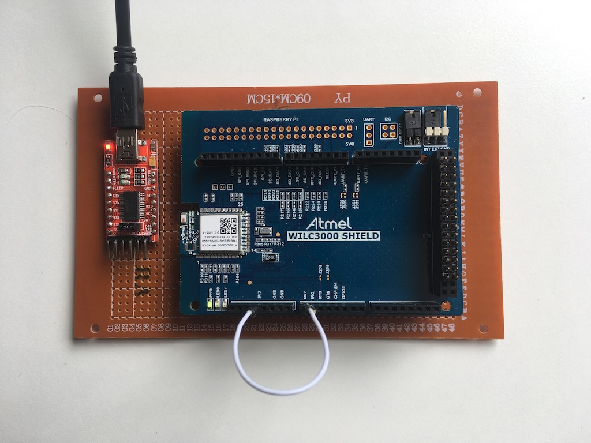

# BTstack Port for POSIX Systems with Atmel ATWILC3000 Controller
This port allows to use the ATWILC3000 connected via UART with BTstack running on a POSIX host system, see test setup below (which lacks a proper RESET button).

## Compilation

$ make

The Makefile downloads the wilc3000_bt_firmware.bin firmware from the [GitHub atwilc3000/firmware](https://github.com/atwilc3000/firmware) repo.

## Usage

Just run any of the provided examples, e.g.

$ ./le_counter

At start, the firmware file is first uploaded to the ATWILC3000, before BTstack start up.

Please note that it configures the ATWILC3000 for a higher baud rate it does not detect if the firmware has already been downloaded, so you need to reset the ATWILC3000 before starting an example.

Tested with the official [ATWILC3000 SHIELD](http://www.microchip.com/DevelopmentTools/ProductDetails.aspx?PartNO=ATWILC3000-SHLD) on OS X.

