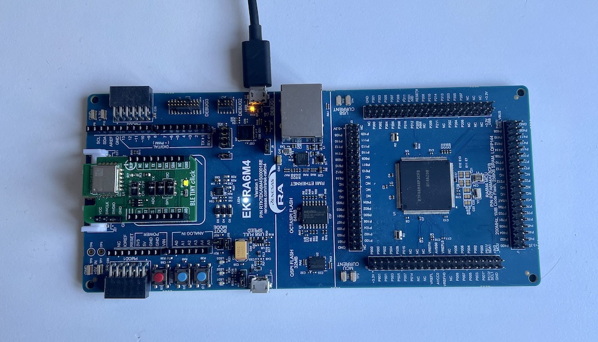

# BTstack Port for Renesas Eval Kit EK-RA6M4 with DA14531

This port uses the [Renesas EK-RA6M4](https://www.renesas.com/us/en/products/microcontrollers-microprocessors/ra-cortex-m-mcus/ek-ra6m4-evaluation-kit-ra6m4-mcu-group) and a Renesas DA14531 Controller on the [MikroeE BLE Tiny Click board](https://www.mikroe.com/ble-tiny-click)

Renesas e2 Studio (Eclise-based) was used with the FSP HAL and without an RTOS to generate project sources.
Then, a new CMake buildfile was created to allow for cross-platform development and compilation of all examples.
For easy debugging, Ozone project files are generated as well.

## Hardware

### Renesas Eval Kit EK-RA6M4:
- The RA6 contains a build in J-Link programmer which supports debut output via SEGGER RTT.
- It uses the MikroBus port for the DA1451 

| MikroBus | MCU   | Function            |
|----------|-------|---------------------|
| J21/2    | P115  | RESET (active high) | 
| P21/3    | P205  | RTS                 |
| J21/4    | P204  | CTS                 |
| J22/4    | P613  | TX                  |
| J22/3    | P614  | RX                  |

- UART RTS: Manual RTS control in UART callback handler. MikroBus slot with UART 7 does not have RTSCTS7
  on the pin used by BLE Tiny Click module.
- BSP
```
// 0x1000 main stack
#define BSP_CFG_STACK_MAIN_BYTES (0x1000)

// printf allocates memory from the heap
#define BSP_CFG_HEAP_BYTES (0x800)
```

### Renesas DA14531 Module on MikroE BLE Tiny Click board with 
- The board comes with some demo application and needs to be programmed with an HCI firmware to use it with a regular Bluetooth stack.
- Firmware details:
  - Keil uVision project `DA145xx_SDK/x.x.xx.xxxx/projects/target_apps/hci` on Windows

```
// Config: user_periph_setup.h
#define UART1_TX_PORT   GPIO_PORT_0
#define UART1_TX_PIN    GPIO_PIN_6
#define UART1_RX_PORT   GPIO_PORT_0
#define UART1_RX_PIN    GPIO_PIN_5
#define UART1_RTSN_PORT GPIO_PORT_0
#define UART1_RTSN_PIN  GPIO_PIN_7
#define UART1_CTSN_PORT GPIO_PORT_0
#define UART1_CTSN_PIN  GPIO_PIN_8
#define UART1_BAUDRATE  UART_BAUDRATE_460800
#define UART1_DATABITS  UART_DATABITS_8

// Config: user_config.h
static const sleep_state_t app_default_sleep_mode = ARCH_SLEEP_OFF;
```

- Firmware installation:
  - Connect GND (pin 5) and VCC (pin 6) with jumper wires to the RA6 dev board. 
  - Connect it with a ARM-Cortex 10-pin connector to a J-Link device
  - Start [SmartBond Flash Programmer](https://www.renesas.com/kr/en/software-tool/smartbond-flash-programmer)
  - The Programmer should auto-detect the DA14531 via the J-Link.
  - Select `firmware/hci_531_rx05_tx06_rts07_cts08_468000.hex` as firmware file and click `Program`

## Software

The port provides a CMake project file that uses the installed Arm Gnu Toolchain.

- Install [Arm GNU Toolchain](https://developer.arm.com/Tools%20and%20Software/GNU%20Toolchain)
- Install [CMake](https://cmake.org)
- Install [Ninja](https://ninja-build.org)
- To compile, go to the port folder:

    `cd btstack/port/renesas-ek-ra6me4a-da14531`

- Create a build folder and go to build folder

    `mkdir build && cd build`

- Create Ninja build files

   `cmake -G Ninja ..`

- Build all examples

    `ninja`

This will build all examples as .elf files as well as .jdebug Ozone debug project files
Alternatively, the CMakeLists.txt can be used to compile using Make (`cmake -G "Unix Makefiles" ..` and `make`) or
or use the project in most modern IDEs (CLion, Visual Studio, Visual Studio Code, ...)


## Run Example Project using Ozone

After building the examples, the generated .elf file can be used with Ozone.
Start Ozone and open the provided .jdebug file. The debug output is readily available in the RTT Terminal.


## Debug output

All debug output is send via SEGGER RTT.

In src/btstack_config.h resp. in example/btstack_config.h of the generated projects.

Also, the full packet log with addtional log information can be enabled in src/hal_entry.c by uncommenting the hci_dump_init(...) call.

The console output can then be converted into .pklg files by running tool/create_packet_log.py. The .pklg file can be
analyzed with the macOS X PacketLogger or WireShark.


## Setup



## Updating HAL Configuration
- Start Renesas RA v3.7.0/e2-studio on Windows and open `e2-project`
- Open `configuration.xml` to get to "FSP Configuration" perspective
    - to add modules, click "New Stack"
    - module is configured in "Properties" view (usually below next to 'Problems' etc)
- Press button re-generates sources
- Copy folder `e2-project` into this port
- Check diff for unexpected changes
- If needed:
  - Update CMakeLists.txt to add new modules
  - Add code to enable ('open') new module in `R_BSP_WarmStart` of `port/hal_entry.c`
