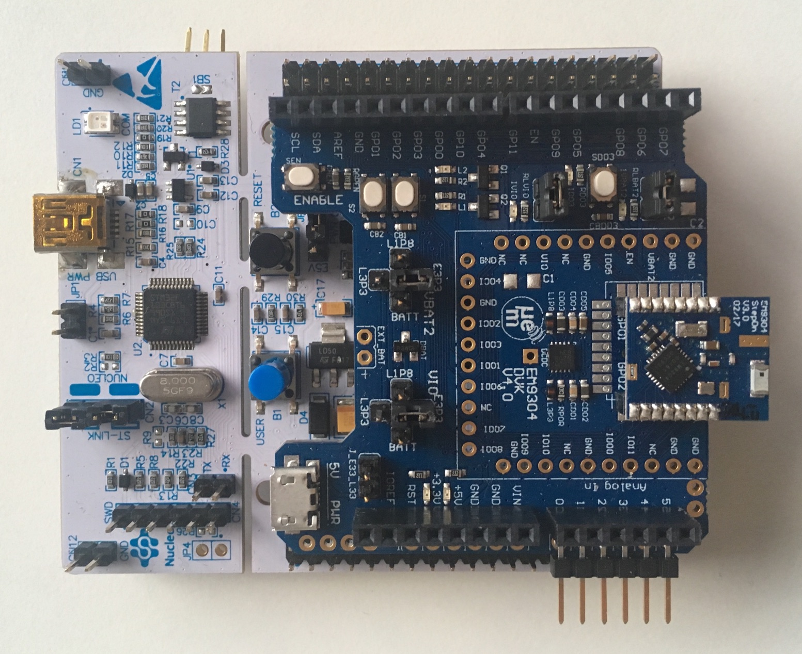

# BTstack Port for STM32 Nucleo L073RZ Board with EM9304 Controller

This port uses the STM32 Nucleo-L073RZ Board with EM's EM9304 Shield. 

The STM32CubeMX tool was used to provide the HAL, initialize the device, and create a basic Makefile. The Makefile has been exteneded to compile all BTstack LE examples. 
For easy development, Ozone project files are generated as well.

## Hardware

In this port, the EM9304 is conencted via the SPI1 interface and configured for 8 Mhz. [Datasheet for the EM9304](http://www.emmicroelectronic.com/sites/default/files/public/products/datasheets/9304-ds_0.pdf)

It assumes that the EM9304 does not contain any patches and uploads the latest Metapatch during startup.

## Software

To build all examples, run make

	$ make

All examples and the .jedbug Ozone project files are placed in the 'build' folder.

## Flash And Run The Examples

The Makefile builds different versions: 
- example.elf: .elf file with all debug information
- example.bin: .bin file that can be used for flashing

There are different options to flash and debug the F4 Discovery board. The F4 Discovery boards comes with an on-board [ST-Link programmer and debugger](https://www.st.com/en/development-tools/st-link-v2.html). As an alternative, the ST-Link programmer can be replaced by an [SEGGER J-Link OB](https://www.segger.com/products/debug-probes/j-link/models/other-j-links/st-link-on-board/). Finally, the STM32 can be programmed with any ARM Cortex JTAG or SWD programmer via the SWD jumper.

## Run Example Project using Ozone

When using an external J-Link programmer or after installing J-Link OB on the F4 Discovery board, you can flash and debug using the cross-platform [SEGGER Ozone Debugger](https://www.segger.com/products/development-tools/ozone-j-link-debugger/). It is included in some J-Link programmers or can be used for free for evaluation usage.

Just start Ozone and open the .jdebug file in the build folder. When compiled with "ENABLE_SEGGER_RTT", the debug output shows up in the Terminal window of Ozone. 

## Debug output

All debug output can be either send via SEGGER RTT or via USART2. To get the console from USART2, connect PA2 (USART2 TX) of the Discovery board to an USB-2-UART adapter and open a terminal at 115200.

In src/btstack_config.h resp. in example/btstack_config.h of the generated projects, additional debug information can be enabled by uncommenting ENABLE_LOG_INFO.

Also, the full packet log can be enabled in src/port.c by uncommenting the hci_dump_init(..) line. The console output can then be converted into .pklg files for OS X PacketLogger or WireShark by running tool/create_packet_log.py

## GATT Database
In BTstack, the GATT Database is defined via the .gatt file in the example folder. During the build, the .gatt file is converted into a .h file with a binary representation of the GATT Database and useful defines for the application.

## Image

