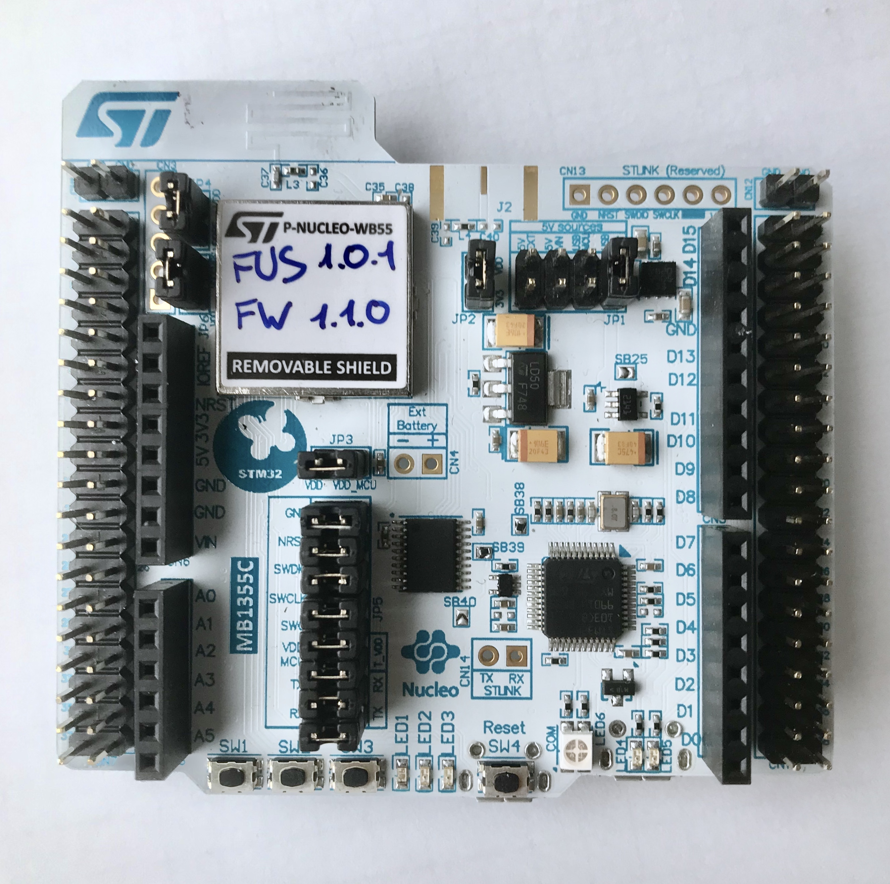

# BTstack port for STM32WB55 Nucleo Board

This port uses the P-NUCLEO-WB55 Board.

STM32Cube_FW_WB_V1.1.0 was used to provide the HAL and WPAN, initialize the device. The Makefile has been extended from l073rz-nucleo example to compile all BTstack LE examples. 
For easy development, Ozone project files are generated as well.

## Hardware

In this port, only a P-NUCLEO-WB55 with FUS v1.0.1 and FULL BLE stack v1.1.0 is needed.
Traces are sent over USART1 to ST-Link v2.

## Software

To build all examples, run make

	$ make

FreeRTOS V10.2.0 is used to run stack, you can get this example version by checking out official repo:

	$ cd Middlewares
	$ git submodule add https://github.com/aws/amazon-freertos.git
	$ git submodule update
	& cd amazon-freertos && git checkout v1.4.8

Or by specifying path to FreeRTOS

	$ make FREERTOS_ROOT=path_to_freertos

All examples and the .jedbug Ozone project files are placed in the 'build' folder.

## Flash And Run The Examples

The Makefile builds different versions: 
- example.elf: .elf file with all debug information
- example.bin: .bin file that can be used for flashing

There are different options to flash and debug the WB Nucleo board. The WB Nucleo boards comes with an on-board [ST-Link programmer and debugger](https://www.st.com/en/development-tools/st-link-v2.html). As an alternative, the ST-Link programmer can be replaced by an [SEGGER J-Link OB](https://www.segger.com/products/debug-probes/j-link/models/other-j-links/st-link-on-board/). Finally, the STM32 can be programmed with any ARM Cortex JTAG or SWD programmer via the SWD jumper.

## Run Example Project using Ozone

When using an external J-Link programmer or after installing J-Link OB on the WB Nucleo board, you can flash and debug using the cross-platform [SEGGER Ozone Debugger](https://www.segger.com/products/development-tools/ozone-j-link-debugger/). It is included in some J-Link programmers or can be used for free for evaluation usage.

Just start Ozone and open the .jdebug file in the build folder. When compiled with "ENABLE_SEGGER_RTT", the debug output shows up in the Terminal window of Ozone. 

## Debug output

All debug output can be either send via SEGGER RTT or via USART1. To get the console from USART1, simply connect your board under STLink-v2 to your PC or connect PB6 (USART1 TX) of the Nucleo board to an USB-2-UART adapter and open a terminal at 115200.

In src/btstack_config.h resp. in example/btstack_config.h of the generated projects, additional debug information can be enabled by uncommenting ENABLE_LOG_INFO.

Also, the full packet log can be enabled in src/btstack_port.c by uncommenting the hci_dump_open(..) line. The console output can then be converted into .pklg files for OS X PacketLogger or WireShark by running tool/create_packet_log.py

## GATT Database
In BTstack, the GATT Database is defined via the .gatt file in the example folder. During the build, the .gatt file is converted into a .h file with a binary representation of the GATT Database and useful defines for the application.

## Image

